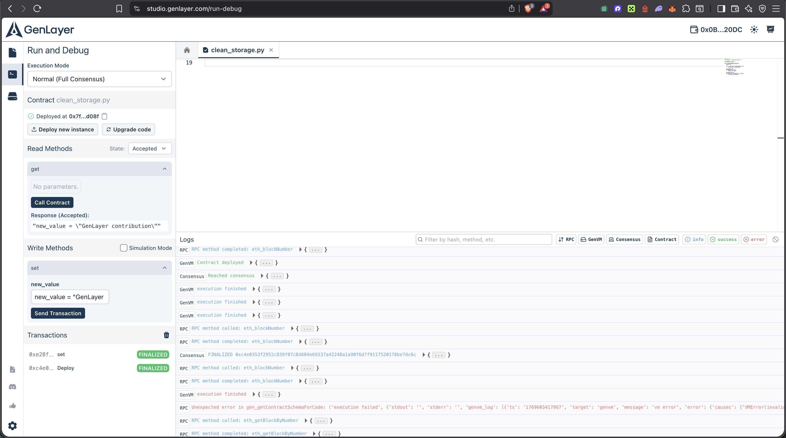

# GenLayer Clean Storage Example

This repository contains a minimal reference implementation of an
Intelligent Contract deployed on **GenLayer** using **GenLayer Studio**.

## Overview

The contract demonstrates:
- Persistent on-chain storage
- Read (view) and write methods
- Full consensus execution via GenVM

It is intended as a simple starting point for developers deploying their
first GenLayer contracts.

## Contract

- Language: Python (GenLayer)
- ABI version: v0.1.2
- Contract file: `clean_storage.py`

### Methods

- `get()` — returns the stored value
- `set(new_value)` — updates the stored value via a write transaction

## Deployment

The contract was deployed using **GenLayer Studio** in
**Normal (Full Consensus)** mode.

Steps:
1. Deploy contract with an initial value
2. Execute a write transaction (`set`)
3. Verify persistence via a read call (`get`)

A screenshot of the finalized deployment and interaction is included below.

## Screenshot

## Notes

This example intentionally avoids advanced features (events, external calls)
to provide a clean and reliable reference for first-time builders.
